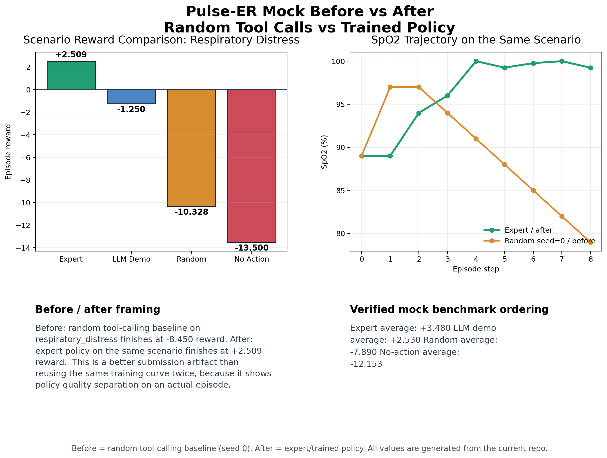

# Pulse-ER: Building an Emergency Medicine RL Environment on Top of Real Physiology

[Hugging Face Space](https://huggingface.co/spaces/KChad/Pulse_ER_env)  
[Docker Hub](https://hub.docker.com/r/clashking9999/pulse-er-env)

## Introduction

Pulse-ER is a reinforcement learning environment for emergency trauma care built on top of the Pulse Physiology Engine. At a high level, the project asks a simple but ambitious question: what happens if we stop training an agent on static medical benchmarks and instead force it to treat a patient whose body actually responds to intervention over time?

That shift changes everything.

In Pulse-ER, the agent is not solving a one-shot classification problem. It is operating inside a live resuscitation loop. The patient can bleed, desaturate, compensate, deteriorate, and die. Oxygen changes oxygenation. Fluids change perfusion. Pressors change hemodynamics. Needle decompression changes respiratory mechanics. Time itself is part of the problem, because waiting too long is not neutral. The environment is designed around the "golden hour" of emergency medicine, where sequencing, reassessment, and protocol discipline matter just as much as recognizing the right diagnosis.

What makes the project especially interesting is that it does not fake those consequences with a shallow rules engine. Instead, it wraps a real physiology simulator and turns it into an RL training environment, an evaluation platform, a clinical tool-use benchmark, and a judgeable demo surface all at once. The result is a system where an agent is rewarded not for sounding medically plausible, but for doing things in the right order against a body that pushes back.

This post walks through why we built the project, why the problem is important and genuinely difficult, why the Pulse Physiology Engine is such a strong foundation, and how the full Pulse-ER stack is put together.

## Why We Built It

A lot of medical AI evaluation still happens in settings that are much cleaner than real care. A model might be asked to answer a question, produce a diagnosis, choose from a list of options, or explain what it would do next. Those tasks are useful, but they miss a major part of emergency medicine: treatment is sequential, stateful, and irreversible.

In trauma care, an intervention is not just "correct" or "incorrect" in the abstract. It changes the next state of the patient. A good action taken too late may fail. A reasonable action taken in the wrong order may worsen the patient. A model that can describe ATLS principles in prose is not necessarily a model that can execute them under pressure.

That is the gap Pulse-ER is trying to close.

The project is motivated by the idea that if we want agents to become better at operational medical decision-making, then we need environments that behave more like actual care:

- The patient state should evolve continuously.
- Actions should have physiologic consequences.
- Observations should be incomplete and noisy.
- Diagnostics should take time.
- The correct strategy should depend on order, not just content.
- Evaluation should reward survival, stability, safety, and protocol quality together.

Pulse-ER turns those goals into an actual training and evaluation system. It gives an agent a patient, a scenario, and a tool surface, then asks it to manage the case step by step.

## Why This Matters

The importance of a project like this is not just that it is "more realistic." It is that realism changes what the agent has to learn.

In a standard benchmark, a model can often succeed by recognizing patterns in a snapshot. In Pulse-ER, that is not enough. The agent must build a mental model of physiology and act with a sense of trajectory. It has to ask questions like:

- Is this low blood pressure primarily a volume problem, an obstructive problem, or both?
- Is oxygen enough, or is the airway failing?
- Are we improving, or are we just buying seconds?
- Should we treat immediately, reassess first, or order diagnostics?
- Which action helps now without making the next step worse?

That makes Pulse-ER useful in several ways.

First, it is a stronger testbed for sequential clinical reasoning. Instead of rewarding fluent medical language, it rewards action sequences that actually stabilize a simulated patient.

Second, it is an unusually good environment for studying tool use. The agent does not just emit text. It chooses structured actions, supplies arguments, and receives consequences back from the environment.

Third, it creates a better bridge between RL research and domain-grounded simulation. The project is not merely a medical chatbot with a fancy prompt. It is a closed-loop control problem over a clinically meaningful state space.

Finally, it creates a useful evaluation surface for interpretability. Pulse-ER does not stop at raw reward. It also exposes an ATLS-style judge, monitor visualizations, detailed action histories, generated pathology blueprints, and adversarial stress tests. That makes it easier to understand not only whether an agent succeeded, but how.

### Evidence on the Real Pulse Runtime


This chart captures the most important empirical result in the project: the training curve on the real Pulse Physiology Engine in a polytrauma scenario. The orange line is the untrained baseline, which remains strongly negative because poor action sequences repeatedly allow deterioration and death. The blue line is the GRPO-trained policy, which climbs from failure into positive reward and eventually converges near the best achievable return. In other words, the agent is not merely learning to sound medical. It is learning intervention sequences that actually stabilize a simulated trauma patient under a real physiology backend.

## Why This Problem Is Difficult

Pulse-ER is difficult for reasons that are structural, not cosmetic.

### 1. Physiology creates real consequences

Because the environment is backed by Pulse, actions have downstream effects that emerge from simulated physiology rather than from a tiny hand-authored table of outcomes. If the patient has tension pneumothorax, simply pouring in fluids does not solve the obstruction. If the patient is bleeding, pressors without volume support are not a clean fix. If oxygenation is collapsing, delay matters.

That means the agent cannot rely on superficial tool-to-symptom matching. It has to learn something closer to causal intervention logic.

### 2. The environment is partially observable

Pulse-ER intentionally supports observation noise. The environment can perturb or mask SpO2, blood pressure, respiratory rate, EtCO2, and other bedside measurements. That matters because emergency care rarely happens with perfect information. Good policy behavior has to survive uncertainty.

The observation contract also includes delayed diagnostics. Labs are not instant. The agent must order them, wait for simulated time to pass, and then retrieve them from the ready queue. This makes information gathering part of the strategy rather than free metadata.

### 3. Sequencing matters as much as action choice

One of the most important design ideas in the repo is that the environment rewards protocol order, not just tool selection. In trauma, two actions can both be defensible in isolation and still be wrong in sequence.

The canonical example in this project is obstructive shock from tension pneumothorax. The obvious-looking move may be to treat hypotension with fluids, but if decompression has not happened first, the sequence is clinically wrong and the environment penalizes it. The agent is not just learning "which tool is associated with which symptom"; it is learning that some conditions have to be mechanically relieved before volume or vasopressors make sense.

### 4. Time pressure is part of the task

Pulse-ER includes an explicit time-pressure mechanic. After a configurable onset window, deterioration pressure increases and intervention effectiveness decays if the patient remains unstable. This is a subtle but important design choice: hesitation is not treated as passive. The environment teaches urgency.

### 5. Difficulty is patient-specific, not just scenario-specific

The repo includes twenty baseline patient profiles and groups them into easy, medium, and hard tiers based on measured resilience under standardized trauma challenge, not on naming conventions. That means the same injury logic can play out differently depending on patient physiology, which is much more interesting than a fixed scenario on a single synthetic patient.

## The Pulse Physiology Engine

To understand why this project is compelling, it helps to understand the substrate beneath it.

### What Pulse Is

The Pulse Physiology Engine is a C++ simulation engine for human and animal physiology. Its goal is to provide coherent, time-evolving physiology for medical education, research, simulation, and training applications. Rather than acting like a toy environment with a handful of scripted vital sign changes, Pulse simulates multiple organ-system processes and exposes interfaces that other software can integrate with.

In practical terms, that means Pulse can represent a patient as a living system rather than a row in a table. Cardiovascular behavior, respiratory dynamics, oxygenation, blood chemistry, fluid balance, and intervention effects can interact over time. The engine is built as a reusable library, which makes it attractive for systems like Pulse-ER that want to layer a task environment on top of a physiologic core.

The engine repository bundled inside this project also makes its intent clear: Pulse is not a hackathon-only toy. It is built as a full simulation platform with CMake-based builds, static libraries, Python support, C API support, validation workflows, scenario drivers, and broad platform targets. In other words, Pulse-ER is standing on top of infrastructure that was designed to be embedded into serious simulation applications.

### Why Pulse Is the Right Foundation Here

If the goal of the project were just to make a benchmark where the patient "looks" medical, a much simpler simulator would have been enough. A few rules for blood pressure, oxygen, and heart rate could produce something demoable.

But that would miss the point.

Pulse gives this project something much more valuable than surface realism: it gives it believable coupling between systems. A chest intervention does not only change one field. Bleeding does not only decrement a health bar. The same action can help in one context, be insufficient in another, or be actively harmful if the underlying physiology is different.

That is exactly what makes emergency medicine interesting as an RL environment. The agent is no longer learning a script. It is learning to manage interacting physiologic failure modes.

### How Pulse Is Used in This Repo

The key integration point is `server/pulse_engine_adapter.py`. This module is the bridge between the project and the Pulse runtime. It bootstraps the local Pulse installation by looking for an install directory with both `bin` and `python` components, adds those paths to Python import resolution, and then imports the Pulse engine bindings.

From there, the adapter becomes the physiologic control layer for the whole system. It can:

- load baseline patient state files
- apply injuries such as hemorrhage, tension pneumothorax, and pericardial effusion
- administer oxygen, airway support, fluids, blood products, pressors, and drug boluses
- advance simulation time
- query or synthesize a structured patient state for the environment

This is a crucial design choice. The rest of the project never has to manipulate raw Pulse internals directly. Instead, it works through a semantic adapter that translates between engine operations and a clean environment contract.

That contract is represented by `PatientState`, which exposes a stable, typed view of the simulated patient: vital signs, oxygenation, perfusion, mental status, labs, active interventions, active hemorrhages, delayed diagnostics, and alerts. The environment then wraps that state in an observation model suitable for agents.

### What Pulse Makes Possible That a Mock Simulator Cannot

The repo actually contains both a real Pulse-backed path and a deterministic mock path. That contrast is helpful.

The mock backend is intentionally lightweight and developer-friendly. It makes fast testing and training possible without a local Pulse installation. But it is still ultimately a simplified approximation driven by authored scenario effects.

The Pulse-backed runtime is different. It gives the project:

- baseline patients with different physiologic reserves
- dynamic response to interventions over simulated time
- richer coupling between respiratory, circulatory, and metabolic state
- more meaningful failure modes
- a stronger foundation for scenario generation and adversarial evaluation

This difference matters because it is the line between "medical-themed RL" and "RL against a real physiology simulator."

### Limitations and Practical Tradeoffs

Using Pulse also introduces practical complexity.

The engine has to be built locally. The adapter has to find the install directory and import the correct bindings. Some tools depend on substances or capabilities that may not exist in a given local build. In this repo, a few actions are explicitly marked unsupported by the current build configuration, including atropine, dopamine, plasma, and massive transfusion protocol support. Instead of crashing, the project returns structured errors for those cases.

That is a good example of the repo's engineering maturity. It treats the physiology engine as a powerful but imperfect dependency, then builds graceful fallbacks and explicit contracts around it.

## Pulse-ER in Detail

Now that the foundation is clear, the project itself becomes much easier to understand.

At a high level, Pulse-ER is a layered system:

1. Pulse simulates physiology.
2. The adapter translates engine operations into a stable patient-state contract.
3. The tool executor exposes clinically meaningful actions.
4. The environment manages episodes, observations, rewards, noise, and time pressure.
5. The API layer exposes the environment over OpenEnv/FastAPI.
6. The client, policy, RL, and evaluation layers sit on top of that runtime.

The rest of the project is essentially about making those layers coherent and useful.

### The Core Environment Loop

The main environment implementation lives in `server/pulse_physiology_env_environment.py`.

On reset, the environment:

- chooses or generates a scenario
- selects a patient profile
- loads the baseline Pulse state
- applies the scenario setup or generated pathology
- initializes reward tracking, state history, and runtime effects
- returns the first observation

On each step, the environment:

- canonicalizes the requested tool name
- executes the tool against the Pulse adapter
- applies episode rules and state updates
- scores the transition with the reward engine
- records the new state in history
- builds an observation enriched with metadata

That metadata is one of the strongest design choices in the repo. Each observation can include reward breakdowns, tool availability, monitor payloads, ATLS judge output, generated pathology information, and runtime-effect metadata such as noise and time-pressure state. The environment is not just producing numbers for an RL loop; it is producing inspectable traces for humans too.

### The Observation Model

The observation contract is defined through `patient_state.py` and `models.py`. It exposes a clinically oriented patient state rather than raw engine internals.

Important fields include:

- hemodynamics: heart rate, systolic and diastolic blood pressure, MAP, cardiac output, blood volume
- respiratory state: SpO2, respiratory rate, breath sounds, EtCO2, tidal volume
- clinical assessment state: mental status, shock index, lactate trend, alerts
- interventions: oxygen device, airway support, intubation, infusions, active hemorrhages
- diagnostics: ABG, CBC, BMP, pending diagnostics, ready diagnostics

This is a strong abstraction boundary. An agent gets information that feels clinically meaningful, but it is still grounded in a simulation that can be much richer internally.

### The Action Surface

The action model in Pulse-ER is built around tool use. Agents send structured actions like:

```json
{
  "tool_name": "give_fluids",
  "arguments": {
    "volume_ml": 500,
    "fluid_type": "blood",
    "rate_ml_per_min": 150
  }
}
```

The project supports a compact public tool contract for general consumers while also exposing a richer internal clinical surface on the runtime side. The server-side executor maps tool names to handlers that call into the Pulse adapter.

This is where the project becomes more than a normal simulator wrapper. The agent is being evaluated not just as a predictor, but as a tool-using operator acting inside a structured clinical API.

### Reward Design

The reward engine in `server/reward_engine.py` is one of the most sophisticated parts of the repo.

Rather than collapsing everything into a single opaque scalar, it tracks reward as a bundle of interpretable components. Broadly, the engine cares about:

- restoration of perfusion
- improvement in oxygenation
- reversal of shock or metabolic deterioration
- safety of intervention order
- timeliness of diagnostics
- anti-exploitation penalties for spammy or low-value behavior
- terminal outcomes such as survival, efficiency, and sequence quality

This matters because the environment is trying to teach a style of care, not just maximize a hidden score. The reward function is deliberately shaped to make clinically meaningful sequences easier to learn and easier to analyze.

One especially good design choice is that safety penalties are order-sensitive. Starting vasopressors before adequate volume support, giving fluids before decompression in obstructive physiology, or performing unsafe RSI-style drug sequences are all treated as meaningful mistakes.

### ATLS Judge and Human Interpretability

Reward alone is not always a satisfying explanation for why an agent did well or poorly. That is why the repo includes `server/atls_judge.py`.

The ATLS judge takes the patient state, action history, reward profile, and state history, then produces a human-readable scorecard with checks like:

- whether the agent assessed before treating
- whether decompression happened before fluids in the right scenarios
- whether hemorrhage control happened early enough
- whether pressors were used after volume support
- whether diagnostics were timely
- whether major safety violations occurred

This is an important bridge between RL optimization and clinically legible evaluation. A good blog-worthy project is not only one that trains an agent, but one that lets humans inspect the logic of its success and failure. Pulse-ER clearly aims for that.

### Scenario Design and Patient Pools

The project includes fixed scenarios in `server/scenarios.py` and generated scenarios in `server/pathology_architect.py`.

The fixed scenarios define the baseline challenge buckets and patient pools. The interesting part is that patient difficulty is tied to measured resilience, not a superficial label. That means the same underlying trauma logic can be tested across different physiologic baselines.

The generated scenario path is even more interesting. The `PathologyArchitect` can build a pathology blueprint from:

- a patient ID
- one or more injury types
- a severity value

It then translates that blueprint into a concrete scenario definition and setup action sequence. This gives the project procedural case generation without giving up physiologic grounding.

### Adversarial Evaluation

One of the best ideas in the repo is the injury-stacking adversary in `injury_stack_adversary.py`.

Instead of evaluating a policy only on average reward, the adversary tests robustness by stacking injuries in increasingly difficult combinations across the patient cohort. It asks a sharper question: what is the first combination that breaks the policy for a given patient?

That is a much more informative failure measure than a single scalar score. It reveals fragility, not just average competence. It also makes the environment feel more like a benchmark for resilience under physiologic complexity rather than a collection of isolated tasks.

### Runtime Effects: Noise and Time Pressure

The runtime effects layer in `runtime_effects.py` adds two forms of realism that matter a lot:

- observation noise and monitor dropouts
- time-pressure scaling for deterioration and intervention effectiveness

The observation noise system can perturb or hide important fields such as blood pressure, SpO2, respiratory rate, and EtCO2. The time-pressure system increases deterioration pressure once instability persists beyond a threshold.

These are relatively small modules, but they make the overall environment much stronger. They prevent the project from becoming a deterministic sequence puzzle.

### Monitoring and Demo Surfaces

Pulse-ER is also designed to be shown, not just trained.

The monitor builder in `server/patient_monitor.py` converts state history and action history into dashboard-friendly payloads: tiles, trend points, events, active interventions, alerts, and demo headlines. The API layer in `server/app.py` serves both the environment and a Space-style dashboard, along with endpoints for pathology generation and demo playback.

This is worth calling out because it reveals a larger product instinct in the repo. The project is not just an engine wrapper for researchers. It is also trying to be a compelling demonstration artifact for judges, collaborators, and users who want to see the physiology move.

### Real Backend, Mock Backend, and Training Interfaces

Another strong architectural decision is the split between the real and mock runtime paths.

The real path is centered on the Pulse-backed environment and exposed through `real_backend.py`, which adapts the richer runtime into the stable consumer-facing `EnvironmentResponse` contract.

The mock path lives in `server/adapters.py` and `server/mock_scenarios.py`. It provides deterministic, fast-running scenarios that are useful for:

- smoke tests
- parser validation
- policy debugging
- lightweight RL experiments

This separation keeps development practical. People can iterate without requiring a full Pulse installation, while still retaining a path to a much more realistic backend for serious evaluation.



The mock training curve tells a different but equally useful story. In the respiratory distress scenario, the trained policy improves quickly and smoothly because the mock backend is deterministic, fast, and intentionally simplified. That makes it ideal for smoke tests, reward debugging, parser validation, and early RL iteration. The contrast between this figure and the real Pulse curve is exactly what makes the project strong: the mock environment accelerates development, while the real Pulse environment tells us whether those learned behaviors survive a harder and more physiologically grounded setting.

### RL and Policy Layers

The repo supports more than one style of training and evaluation.

For policy execution and trace capture, `episode_runner.py` provides a reusable loop over backend, policy, retries, budget, and termination conditions.

For scripted and heuristic baselines, `policies.py` includes expert-style playbooks, random behavior, no-action baselines, and an LLM-style policy wrapper.

For prompt-based tool use, `prompt_builder.py` and `tool_parser.py` provide a compact prompt-to-JSON-to-tool-call pipeline.

For online RL, `gym_env.py` exposes a Gym-style wrapper with discrete macro-actions and observation featurization, while `train_online.py` provides a lightweight REINFORCE baseline.

For submission-facing GRPO training, `trl_env.py` and `train_grpo.py` wrap the environment in a TRL/OpenEnv-compatible interface. This is a particularly nice touch because it shows the repo was designed not just as a simulator, but as a trainable benchmark integrated into a modern RL tooling stack.

## What Makes the Project Strong

A lot of technically interesting repositories have one strong idea. Pulse-ER has several, and they fit together unusually well.

It combines:

- a real physiology substrate
- a clean patient-state contract
- structured tool use
- protocol-aware reward shaping
- human-readable judging
- generated pathology authoring
- adversarial robustness evaluation
- mock and real backend separation
- RL-friendly wrappers
- a demo-ready dashboard surface

That combination is what makes the project more impressive than a simple "medical environment" label suggests. It is not just a simulator. It is a full stack for training, evaluating, visualizing, and stress-testing emergency-care agents against physiologic consequences.

## Limitations and Future Directions

The repo is already ambitious, but its own structure also points to clear future growth.

One direction is deeper physiologic coverage. The richer internal tool surface suggests room for exposing more advanced interventions cleanly to agents over time.

Another is stronger adversarial search. The current injury-stacking ladder is already valuable, but it naturally suggests future extensions such as severity search, longer-horizon deterioration studies, or prolonged-care scenarios.

There is also room for larger-scale policy training. The training wrappers are already in place, and the environment is well-suited to experiments around sequential tool use, protocol compliance, and robustness under partial observability.

Finally, the interpretability surfaces could become even more central. Pulse-ER already includes reward breakdowns, ATLS judging, and patient monitor payloads. That makes it a promising platform not just for building agents, but for studying why agents succeed or fail in clinically meaningful ways.

## Conclusion

Pulse-ER is compelling because it attacks the right problem at the right level of abstraction.

It does not reduce emergency care to a static benchmark. It treats it as a sequential control problem over a patient whose physiology evolves in time. It does not ask an agent to sound medically informed. It asks the agent to act through a tool interface and live with the consequences. And it does not stop at reward optimization; it adds protocol judgment, monitoring, scenario generation, and adversarial evaluation on top of the core environment.

Most importantly, it chooses a strong foundation. By building on the Pulse Physiology Engine, the project inherits something that purely synthetic simulators usually lack: the feeling that actions are being taken against an actual body model rather than a thin scoring script.

That is what gives the project its identity.

Pulse-ER is not just an RL environment with medical flavoring. It is an attempt to build a clinically grounded, physiology-backed decision-making benchmark where timing, order, uncertainty, and consequence all matter. That makes it technically interesting, practically useful, and exactly the kind of project that deserves a serious blog post.
